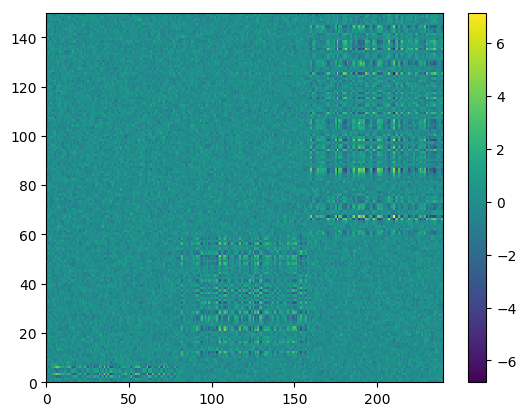
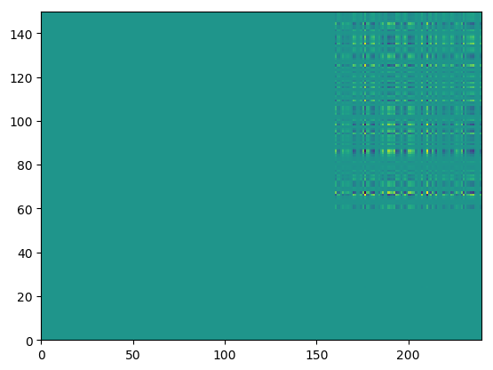
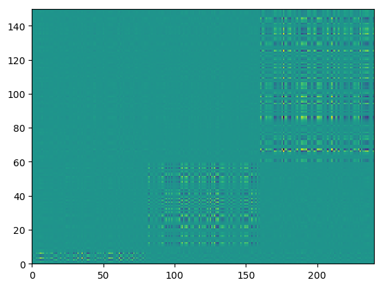
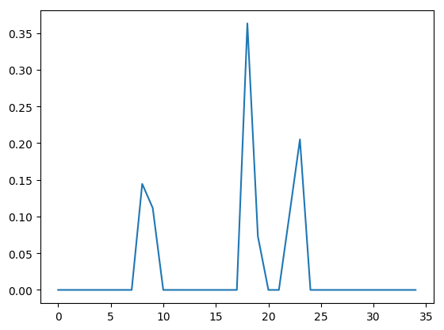

# PMD and Flash

In this note, we implement PMD and flash and compare their performance and computation time.


```julia
using JuMP, Ipopt, Roots, PyPlot, RCall
```

    WARNING: Method definition describe(AbstractArray) in module StatsBase at /Users/Yskim/.julia/v0.5/StatsBase/src/scalarstats.jl:573 overwritten in module DataFrames at /Users/Yskim/.julia/v0.5/DataFrames/src/abstractdataframe/abstractdataframe.jl:407.


```julia
N = 150; P = 240; K = 3;
L = zeros(N,K); F = zeros(P,K);
srand(2017);
L[1:10,1] = 2 * randn(10); L[11:60,2] = randn(50); L[61:150,3] = 0.5 * randn(90)
F[1:80,1] = 0.5 * randn(80); F[81:160,2] = randn(80);  F[161:240,3] = 2 * randn(80);
G = L * F';
E = randn(N,P) * 0.5;
Y = G + E;
pcolormesh(Y)
colorbar()
```





    PyObject <matplotlib.colorbar.Colorbar object at 0x329566d10>


```julia
function pmd_sub(a,c)
    f(t) = sum(max(abs(a) - t,0) / norm(max(abs(a) - t,0))) - c;
    sol = fzero(f,0,norm(a,Inf))
    if isnan(f(sol))
        sol = 0;
    end
    return sign(a) .* max(abs(a) - sol,0) / norm(max(abs(a) - sol,0))
end
```

    WARNING: Method definition pmd_sub(Any, Any) in module Main at In[78]:2 overwritten at In[89]:2.


    pmd_sub (generic function with 1 method)


```julia
function pmd_rank1(Y)
    temp = svdfact(Y);
    u = temp[:U][1,:]; v = temp[:Vt][:,1]';
    c1 = 7;
    c2 = 7;
    for i = 1:10
        v = pmd_sub(Y'*u,c1);
        u = pmd_sub(Y*v,c2)
    end
    pcolormesh(u*v')
    return u, v;
end
```

    WARNING: Method definition pmd_rank1(Any) in module Main at In[157]:2 overwritten at In[159]:2.


    pmd_rank1 (generic function with 1 method)


```julia
pmd_rank1(Y)[1]
```





    150-element Array{Float64,1}:
     -0.0       
     -0.0       
      0.0       
      0.0       
      0.0       
      0.0       
     -0.0       
     -0.0       
     -0.0       
      0.0       
     -0.0       
      0.0       
      0.0       
      ⋮         
      0.158839  
      0.0411971 
      0.00509731
      0.0963436 
     -0.0671758 
     -0.0625562 
     -0.19305   
      0.0100181 
      0.0469841 
      0.0355634 
      0.0501029 
      0.0518133 


```julia
function pmd(Y,k)
    N = size(Y,1); P = size(Y,2);
    U = zeros(N,k); V = zeros(P,k);
    d = zeros(k);
    c1 = 10;
    c2 = 10;
    for j = 1:k
        temp = svdfact(Y);
        u = temp[:U][1,:]; v = temp[:Vt][:,1]';
        for i = 1:10
            v = pmd_sub(Y'*u,c1);
            u = pmd_sub(Y*v,c2)
        end
        d[j] = (u'*Y*v)[1];
        U[:,j] = u; V[:,j] = v;
        Y = Y - d[j]*u*v';
    end
    pcolormesh(U*Diagonal(d)*V')
    return U, V, d;
end
```

    WARNING: Method definition pmd(Any, Any) in module Main at In[127]:2 overwritten at In[129]:2.


    pmd (generic function with 1 method)


```julia
pmd(Y,3);
```





```julia
# line search sequential quadratic programming for primal

function ls_sqp(L)
    n = size(L,1); k = size(L,2);
    iter = 20;
    tol = 1e-2;
    x = ones(k)/k;
    for i = 1:iter
        # gradient and Hessian computation
        Z = Diagonal(1./(L*x)) * L;
        g = -Z'*ones(n);
        H = Z'*Z;
        
        # define a subproblem
        m = Model(solver=IpoptSolver(print_level = 0));
        @variable(m, p[1:k]);
        @objective(m, Min, sum(0.5*p[i]*H[i,j]*p[j] for i = 1:k, j = 1:k )+sum(g[i]*p[i] for i = 1:k));
        @constraint(m, ec, sum(p[i] for i = 1:k) == 0); ## p is only in the simplex
        @constraint(m, ic, p+x .>= 0);                                    
        solve(m);
                                        
        # convergence check - By KKT
        if norm(g - getdual(ic) - getdual(ec),Inf) < tol
            break;
        end
                                        
        # otherwise do update               
        x = abs(getvalue(p)+x); # make sure x is positive
        x = x/sum(x) # renormalize           
    end
    return x
end
```


```julia
# Set a working directory

cd("$(homedir())/Desktop/gaussmix")

# z : date
# m : gridmult
function ash(z,m)
    @rput z m;
    reval("source('./getL.R')");
    L = @rget L;
    x = ls_sqp(L);
    return x
end
```

    WARNING: Method definition ash(Any, Any) in module Main at In[178]:8 overwritten at In[180]:8.


    ash (generic function with 1 method)


```julia
n = 2500;
z = [randn(n);2*randn(n);3*randn(n);5*randn(n)];
n = length(z)
temp = ash(z,1.2);
plot(temp)
```





    1-element Array{Any,1}:
     PyObject <matplotlib.lines.Line2D object at 0x3298a7810>


```julia
function = ash_posterior(z,m)
    @rput z m;
    reval("source('./getL.R')");
    L = @rget L;
    x = ls_sqp(L);
    L.*x
    return x
end
```


```julia
[1 2;3 4] .* [1;2]
```


    2×2 Array{Int64,2}:
     1  2
     6  8


