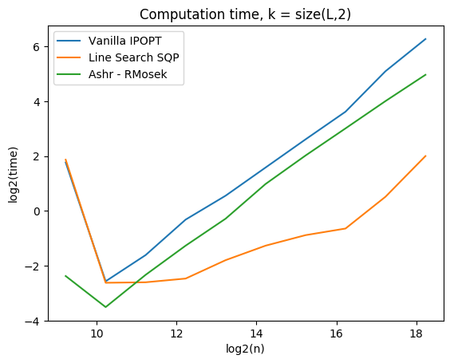
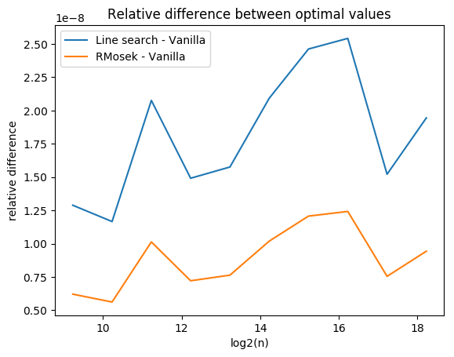
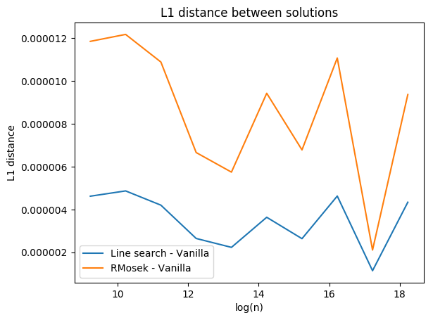
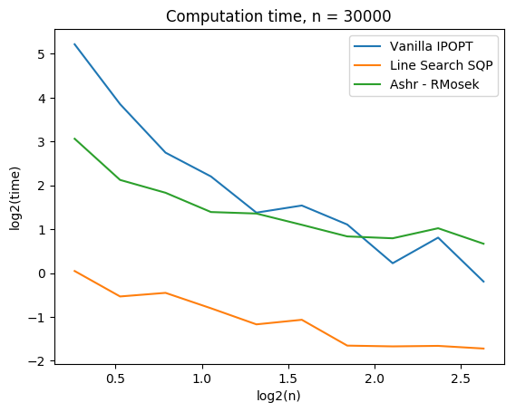
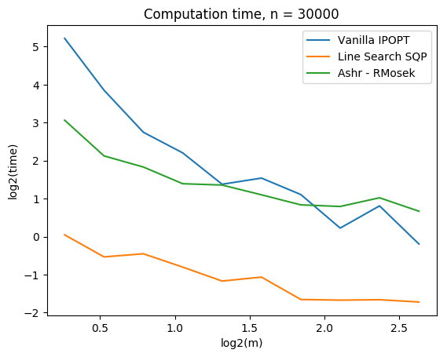
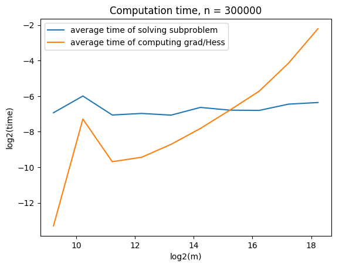

# Time comparison

In this note, we use several algorithms and packages and compare computation time of them.

## Introduction

We call
$$ \textrm{minimize}\quad f(x) = - \sum_{i=1}^n \log \sum_{j=1}^k x_j L_{ij} $$
$$ \textrm{subject to}\quad x \succeq 0,\quad \sum_{j=1}^m x_j = 0 $$
the primal problem (P).

The KW dual problem of (P) is
$$ \textrm{minimize}\quad f(x) = - \sum_{i=1}^n \log y_i $$
$$ \textrm{subject to}\quad y \succeq 0,\quad L^T y \preceq n $$
and is denoted by (D).


```julia
# Call some package
using Ipopt, JuMP, PyPlot, RCall

# Set a working directory

cd("$(homedir())/mixedgauss/CODE/UNCOPT-21")
```

    WARNING: Method definition macroexpand(Module, Any) in module Compat at /Users/Yskim/.julia/v0.5/Compat/src/Compat.jl:1491 overwritten in module MacroTools at /Users/Yskim/.julia/v0.5/MacroTools/src/utils.jl:64.
    WARNING: Method definition describe(AbstractArray) in module StatsBase at /Users/Yskim/.julia/v0.5/StatsBase/src/scalarstats.jl:573 overwritten in module DataFrames at /Users/Yskim/.julia/v0.5/DataFrames/src/abstractdataframe/abstractdataframe.jl:407.


The following is to import $L$ from R code.


```julia
# input
# n : number of observations, g : grid mult

# output
# L : matrix of likelihood, m : grid size, x : solution, t : computation time
function get_L(n,m)
    @rput n m;
    reval("source('./rebayes.R')");
    L = @rget L;
    x = @rget x;
    t = @rget t;
    return L, x, t
end
```

    WARNING: Method definition get_L(Any, Any) in module Main at In[7]:7 overwritten at In[8]:7.


    get_L (generic function with 1 method)


The following codes are for primal and dual vanilla IPOPT.


```julia
# vanilla primal ipopt

function vanilla_ipopt(L)
    n = size(L,1); k = size(L,2);
    m = Model(solver=IpoptSolver(print_level=0));
    @variable(m, x[1:k], start = 1/k);
    @NLobjective(m, Min, -sum(log(sum(L[i,j]*x[j] for j=1:k)) for i=1:n));
    @constraint(m, sum(x) == 1);
    @constraint(m, x.>= 0);
    solve(m);
    return getvalue(x)
end

# vanilla dual ipopt

function vanilla_dual(L)
    n = size(L,1)
    m = Model(solver=IpoptSolver(print_level=0));
    @variable(m, y[1:n] >= 0);
    @NLobjective(m, Min, -sum(log(y[i]) for i=1:n));
    @constraint(m, cons, n .>= L'*y);
    solve(m);
    x = getdual(cons);
    x = x/sum(x);
end
```


    vanilla_dual (generic function with 1 method)


Between line search and trust region we found that Wolfe's condition always holds and the trust region step is always accepted. Therefore, we can avoid backtracking or actual reduction checking. 


```julia
# line search sequential quadratic programming for primal

function ls_sqp(L)
    n = size(L,1); k = size(L,2);
    iter = 20;
    tol = 1e-2;
    x = ones(k)/k;
    for i = 1:iter
        # gradient and Hessian computation
        Z = Diagonal(1./(L*x)) * L;
        g = -Z'*ones(n);
        H = Z'*Z;
        
        # define a subproblem
        m = Model(solver=IpoptSolver(print_level = 0));
        @variable(m, p[1:k]);
        @objective(m, Min, sum(0.5*p[i]*H[i,j]*p[j] for i = 1:k, j = 1:k )+sum(g[i]*p[i] for i = 1:k));
        @constraint(m, ec, sum(p[i] for i = 1:k) == 0); ## p is only in the simplex
        @constraint(m, ic, p+x .>= 0);                                    
        solve(m);
                                        
        # convergence check - By KKT
        if norm(g - getdual(ic) - getdual(ec),Inf) < tol
            break;
        end
                                        
        # otherwise do update               
        x = abs(getvalue(p)+x); # make sure x is positive
        x = x/sum(x) # renormalize           
    end
    return x
end
              

# line search dual SQP

function dual_sqp(L)
    n = size(L,1); k = size(L,2);
    iter = 20;
    tol = 1e-2;
    y = ones(n);
    for i = 1:iter
        # gradient and Hessian computation
        g = -1./y;
        h = 1./(y.^2);
        
        # define a subproblem
        m = Model(solver=IpoptSolver(print_level = 0));
        @variable(m, p[1:n]);
        @objective(m, Min, sum(0.5*p[i]^2*h[i] for i = 1:n)+sum(g[i]*p[i] for i = 1:n));
        @constraint(m, ic1, y+p .>= 0);
        @constraint(m, ic2, n .>= L'*(y+p));
        solve(m);
        x = getdual(ic2);
                            
        # convergence check - By KKT
        if norm(g - getdual(ic1) + L*x,Inf) < tol
            break;
        end
                                           
        # otherwise do update               
        y = abs(getvalue(p)+y); # make sure y is positive
    end
    x = x/sum(x);
    return x
end
```


    dual_sqp (generic function with 1 method)


Now we are ready to compare computation time. Firstly we fix $m$ and let $n$ increase.


```julia
# function evaluation

function eval_f(x) 
  return -sum(log(L*x))
end
```


    eval_f (generic function with 1 method)


```julia
# setting : gridmult is fixed by m = 2
# n_max = 300 * 2^10 > 300000

iter = 10;
range = 300 * 2.^(1:iter);
m = 2;
t1 = zeros(iter); t2 = zeros(iter); t3 = zeros(iter);# t4 = zeros(iter);
d1 = zeros(iter); d2 = zeros(iter);# d3 = zeros(iter);
f1 = zeros(iter); f2 = zeros(iter);# f3 = zeros(iter);

# I don't know why this is needed, but error occurs otherwise
L = get_L(range[1],m)[1];
k = size(L,2);

# compute time
for i = 1:iter
    n = range[i];
    temp = get_L(n,m)
    L = temp[1];
    x3 = temp[2];
    t3[i] = temp[3]; # t3 : RMosek
    tic();
    x2 = ls_sqp(L);
    t2[i] = toq(); # t2 : Line search SQP
    tic();
    x1 = vanilla_ipopt(L); # t1 : Vanilla_IPOPT
    t1[i] = toq();
    f1[i] = eval_f(x2)/eval_f(x1) - 1;
    f2[i] = eval_f(x3)/eval_f(x1) - 1;
    d1[i] = norm(x2-x1,1);
    d2[i] = norm(x3-x1,1);
end
```

    
    ******************************************************************************
    This program contains Ipopt, a library for large-scale nonlinear optimization.
     Ipopt is released as open source code under the Eclipse Public License (EPL).
             For more information visit http://projects.coin-or.org/Ipopt
    ******************************************************************************
    


We plotted computation time in log scale.


```julia
# make time plot
# scale = log2
fig, ax = subplots()
ax[:plot](log2(range),log2(t1),label="Vanilla IPOPT");
ax[:plot](log2(range),log2(t2),label="Line Search SQP");
ax[:plot](log2(range),log2(t3),label="Ashr - RMosek");
ax[:legend](loc="best")
xlabel("log2(n)");
ylabel("log2(time)");
title("Computation time, k = $size(L,2)");
```





Now we want to check if all are successfully converged.


```julia
# make function value plot

fig, ax2 = subplots()
ax2[:plot](log2(range),f1,label="Line search - Vanilla");
ax2[:plot](log2(range),f2,label="RMosek - Vanilla");
ax2[:legend](loc="best")
xlabel("log2(n)");
ylabel("relative difference");
title("Relative difference between optimal values");
```





```julia
# make l1 distance plot

fig, ax3 = subplots()
ax3[:plot](log2(range),d1,label="Line search - Vanilla");
ax3[:plot](log2(range),d2,label="RMosek - Vanilla");
ax3[:legend](loc="best")
xlabel("log(n)");
ylabel("L1 distance");
title("L1 distance between solutions");
```





The next step is to fix $n$ and let $m$ decrease -- $k$ increase


```julia
# setting : n is fixed by n = 30000

iter = 10;
range = 300 * 2.^(1:iter);
m = 1.2;
t1 = zeros(iter); t2 = zeros(iter); t3 = zeros(iter);# t4 = zeros(iter);
d1 = zeros(iter); d2 = zeros(iter);# d3 = zeros(iter);
f1 = zeros(iter); f2 = zeros(iter);# f3 = zeros(iter);

# compute time
for i = 1:iter
    n = range[i];
    temp = get_L(n,m)
    L = temp[1];
    
end
```





```julia
# make time plot
# scale = log2
fig, ax = subplots()
ax[:plot](log2(range),log2(t1),label="Vanilla IPOPT");
ax[:plot](log2(range),log2(t2),label="Line Search SQP");
ax[:plot](log2(range),log2(t3),label="Ashr - RMosek");
ax[:legend](loc="best")
xlabel("log2(m)");
ylabel("log2(time)");
title("Computation time, n = $n");
```





We will look at the time for gradient/Hessian computation and solving subproblem.


```julia
function ls_sqp_time(L)
    n = size(L,1); k = size(L,2);
    iter = 20;
    tol = 1e-2;
    x = ones(k)/k;
    t1 = []; t2 = [];
    for i = 1:iter
        # gradient and Hessian computation
        tic();
        Z = Diagonal(1./(L*x)) * L;
        g = -Z'*ones(n);
        H = Z'*Z;
        temp = toq();
        t1 = [t1;temp];
        
        # define a subproblem
        tic();
        m = Model(solver=IpoptSolver(print_level = 0));
        @variable(m, p[1:k]);
        @objective(m, Min, sum(0.5*p[i]*H[i,j]*p[j] for i = 1:k, j = 1:k )+sum(g[i]*p[i] for i = 1:k));
        @constraint(m, ec, sum(p[i] for i = 1:k) == 0); ## p is only in the simplex
        @constraint(m, ic, p+x .>= 0);                                    
        solve(m);
        temp = toq();
        t2 = [t2;temp];
                                        
        # convergence check - By KKT
        if norm(g - getdual(ic) - getdual(ec),Inf) < tol
            break;
        end
                                        
        # otherwise do update               
        x = abs(getvalue(p)+x); # make sure x is positive
        x = x/sum(x) # renormalize           
    end
    return mean(t1), mean(t2)
end
```

    WARNING: Method definition ls_sqp_time(Any) in module Main at In[160]:2 overwritten at In[184]:2.


```julia
iter = 10;
range = 300 * 2.^(1:iter);
m = 2;
t1 = []; t2 = [];

for i = 1:iter
    L = get_L(range[i],m)[1];
    temp = ls_sqp_time(L);
    t1 = [t1;temp[1]];
    t2 = [t2;temp[2]];
end
t1 = convert(Array{Float64,1}, t1);
t2 = convert(Array{Float64,1}, t2);

# make time plot
# scale = log2
fig, ax = subplots()
ax[:plot](log2(range),log2(t2),label="average time of solving subproblem ");
ax[:plot](log2(range),log2(t1),label="average time of computing grad/Hess");
ax[:legend](loc="best")
xlabel("log2(m)");
ylabel("log2(time)");
title("Computation time, n = $n");
```





```julia
t2
```


    10-element Array{Float64,1}:
     0.00034969
     0.0202479 
     0.00052632
     0.00199895
     0.00248923
     0.00463089
     0.00905375
     0.0189013 
     0.0564988 
     0.211635  


If $L$ is a low rank matrix, we want to solve approximate optimization function. Recall that (P) is
$$ \textrm{minimize}\quad f(x) = - \sum_{i=1}^n \log \sum_{j=1}^k x_j L_{ij} $$
$$ \textrm{subject to}\quad x \succeq 0,\quad \sum_{j=1}^m x_j = 1 $$.

Note that the objective function is
$$ f(x) = -\sum_{i=1}^n \log (Lx)_i $$.
Let $L = USV^T$ be a reduced SVD for numerically low rank matrix $L$. Then the problem becomes
$$ \textrm{minimize} f(x) = -\sum_{i=1}^n \log (USV^Tx)_i $$


```julia
function rank_reduction(L)
    n = size(L,1); k = size(L,2);
    F = svdfact(L);
    iter = 20;
    tol = 1e-2;
    x = ones(k)/k;
    
    # svd for rank reduction
    F = svdfact(L);
    ind = F[:S] .> 1e-4;
    U = F[:U][:,ind];
    s = F[:S][ind];
    Vt = F[:Vt][ind,:];
    
    # iteration
    for i = 1:iter
        # gradient and Hessian computation -- Rank reduction method
        Z = Diagonal(1./(U*(Diagonal(s)*(Vt*x)))) * L;
        g = -Z'*ones(n);
        H = Z'*Z;
        
        # define a subproblem
        m = Model(solver=IpoptSolver(print_level = 0));
        @variable(m, p[1:k]);
        @objective(m, Min, sum(0.5*p[i]*H[i,j]*p[j] for i = 1:k, j = 1:k )+sum(g[i]*p[i] for i = 1:k));
        @constraint(m, ec, sum(p[i] for i = 1:k) == 0); ## p is only in the simplex
        @constraint(m, ic, p+x .>= 0);                                    
        solve(m);
                                        
        # convergence check - By KKT
        if norm(g - getdual(ic) - getdual(ec),Inf) < tol
            break;
        end
                                        
        # otherwise do update               
        x = abs(getvalue(p)+x); # make sure x is positive
        x = x/sum(x) # renormalize           
    end
    return x
end
```


```julia
[n;k]
```


    2-element Array{Int64,1}:
     30000
        79


```julia
L = get_L(30000,1.1)[1];

n = size(L,1); k = size(L,2);
```


```julia
F = svdfact(L);
    ind = F[:S] .> 1e-4;
    U = F[:U][:,ind];
    s = F[:S][ind];
    Vt = F[:Vt][ind,:];
x = ones(k)/k;
sum(ind)
```


23


```julia
[@time Diagonal(1./(U*(Diagonal(s)*(Vt*x)))) * L;@time Diagonal(1./(L*x)) * L];
```

      0.009100 seconds (22 allocations: 18.541 MB)
      0.020003 seconds (11 allocations: 18.540 MB, 55.74% gc time)


```julia
[@time Diagonal(1./(U*(Diagonal(s)*(Vt*x)))) * (U*Diagonal(s)*Vt);@time Diagonal(1./(L*x)) * L];
```

      0.029969 seconds (27 allocations: 41.887 MB, 40.25% gc time)
      0.010796 seconds (11 allocations: 18.540 MB, 27.01% gc time)


```julia
[@time 1./(U*(Diagonal(s)*(Vt*x)));@time 1./(L*x)];
```

      0.000942 seconds (15 allocations: 469.656 KB)
      0.001089 seconds (8 allocations: 469.063 KB)


```julia
function rr_sqp(L)
    n = size(L,1); k = size(L,2);
    F = svdfact(L);
    iter = 20;
    tol = 1e-2;
    x = ones(k)/k;
    
    # svd for rank reduction
    F = svdfact(L);
    ind = F[:S] .> 1e-4;
    U = F[:U][:,ind];
    s = F[:S][ind];
    Vt = F[:Vt][ind,:];
    
    # iteration
    for i = 1:iter
        # gradient and Hessian computation -- Rank reduction method
        d = 1./(U*(Diagonal(s)*(Vt*x)));
        g = -Vt'*(Diagonal(s) * (U'*d));
        H = (Vt'*Diagonal(s)*(U'*Diagonal(d.^2)*U)*Diagonal(s)*Vt);
        
        # define a subproblem
        m = Model(solver=IpoptSolver(print_level = 0));
        @variable(m, p[1:k]);
        @objective(m, Min, sum(0.5*p[i]*H[i,j]*p[j] for i = 1:k, j = 1:k )+sum(g[i]*p[i] for i = 1:k));
        @constraint(m, ec, sum(p[i] for i = 1:k) == 0); ## p is only in the simplex
        @constraint(m, ic, p+x .>= 0);                                    
        solve(m);
                                        
        # convergence check - By KKT
        if norm(g - getdual(ic) - getdual(ec),Inf) < tol
            break;
        end
                                        
        # otherwise do update               
        x = abs(getvalue(p)+x); # make sure x is positive
        x = x/sum(x) # renormalize           
    end
    return x
end
```
